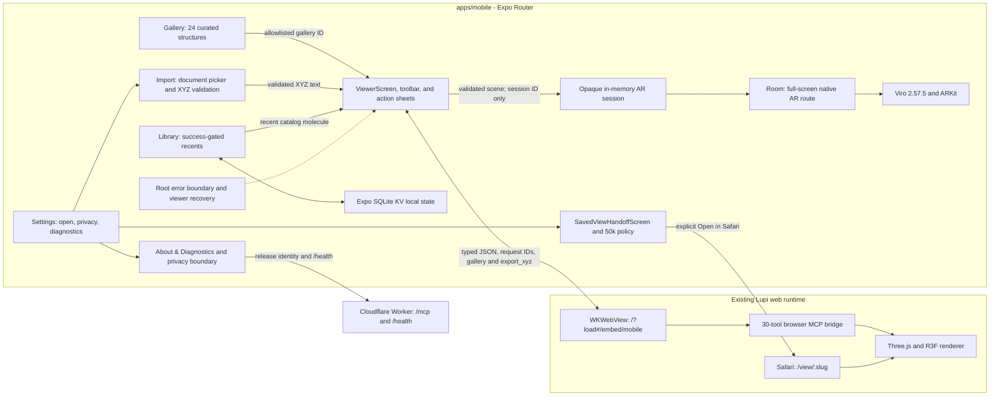

# Lupi mobile: Expo migration and release guide

Status: **Expo SDK 57 hybrid shell plus native Viro/ARKit Room source has a green local verification ladder and audited archive. The compatible 30-tool web bridge is live, SDK 54 has the historical signed development build, and no signed SDK 57, TestFlight, or physical-iPhone receipt exists yet.**

Compatibility snapshot: **2026-08-11**

This document is the engineering plan for turning Lupi into an installable
iPhone app without pretending that the browser renderer can be copied directly
into React Native. The first mobile slice is intentionally hybrid: native Expo
Router screens own discovery, local history, navigation, and device-facing UI;
a constrained `react-native-webview` hosts the existing Lupi viewer. For a
bounded active molecule, that viewer can now hand strict XYZ data to a separate
native ARKit Room scene through a Lupi-owned adapter.

The hybrid is a migration bridge, not the final architecture and not evidence
of native-renderer parity.

This document describes the integrated Room source on
`codex/mobile-testflight-integration`, based on deployed `origin/main` revision
`ee0d8885d90ffb3cd37243d0c1eb998c41e4572f`, plus clearly identified receipts
from the earlier clean Room revision `7c64bd702bd50ecf7b161054ced5c2d806e4c780`.
The native 24-item Gallery, root-stack Viewer, focused Library, Settings, gallery
browser tool, atom-cap contract, and success-only recent-history correlation
passed their full source/browser ladder at historical SDK 55 commit `1a56e398`.
SDK 56 has a historical green local ladder at commit `42536acd`. SDK 57 now has
its own green local ladder and audited 93-file archive; the final integrated
commit still needs its full SHA recorded.
The compatible web bridge is deployed and the earlier Room revision has a signed
development artifact. Those receipts do not assert a signed build of the new
SDK 57/runtime-1.0.1 source, an executed visual workflow, Apple upload,
TestFlight processing, App Store release, or physical-iPhone AR pass.

## Compatibility decision: Expo SDK 57 shell plus development-client AR

`apps/mobile/package.json` pins Expo `~57.0.12`, React Native `0.86.2`, React
`19.2.3`, Expo Router `~57.0.12`, and TypeScript `~6.0.3` as one aligned source
checkpoint. It explicitly includes
`@expo/metro-runtime` and `expo-font`; `app.json` declares the `expo-font` plugin
alongside the Router, SQLite, web-browser, splash, and Viro plugins. EAS
profiles select the `sdk-57` image. Expo Router uses the nested
`NativeTabs.Trigger`, `.Icon`, and `.Label` API rather than an older flat tabs
surface. The SDK 57 DOM/native dependency lines are explicit:
`react-native-webview` `13.16.1`, `expo-web-browser` `~57.0.2`,
`react-native-reanimated` `4.5.1`, `react-native-worklets` `0.10.1`, and
`@react-native/metro-config` `0.86.2`.

The stock iPhone Expo Go client may be used only after its current SDK support is
checked at test time. iOS cannot install an older Expo Go app side-by-side. This
checkpoint has no signed SDK 57 device receipt, so it must not be presented as
an Expo Go or native-device success.

Consequences:

- Do not change Expo, React Native, React, Router, or Expo packages piecemeal.
  The SDK 57 upgrade is one local/development-build checkpoint. Physical-iPhone
  acceptance waits for a signed SDK 57 development build.
- Keep Expo, React Native, React, Router, and Expo package versions aligned with
  SDK 57. Use `npx expo install`, not arbitrary package upgrades, for Expo
  dependencies.
- Use the current App Store Expo Go app on the iPhone only when its current SDK
  compatibility is confirmed. Otherwise, move hybrid-shell testing to the custom
  development client described below.
- A compatible Expo Go client can run the hybrid shell, but it cannot load the
  custom native `@reactvision/react-viro` runtime. Room work must use a
  development or TestFlight build on a physical ARKit iPhone.
- SDK 57 targets React Native `0.86` and React 19.2. Lupi pins Node `22.23.1`
  in every EAS profile and declares iOS `17.6` directly through the built-in
  `ios.deploymentTarget` field because embedded ViroKit requires that higher
  target. The repository requires Node 22.13 or newer.

Windows install note: on this machine, a full root install under Node 24 reached
`canvas@3.2.3` native compilation and failed in the ClangCL toolchain. Prefer a
Node `22.23.1` release for the current monorepo install and verification lane.
`pnpm install --ignore-scripts` was used only as a local package-relink
workaround; because it skips lifecycle/native install work, it is not the
recommended setup and cannot support a complete verification receipt. The
historical SDK 55 candidate and historical SDK 56 lockfile both passed clean
frozen filtered installs under Node `20.19.4` and pnpm `9.0.0` with lifecycle
scripts enabled. Capture the final SDK 57 frozen-install receipt after the
candidate is committed.

Primary references:

- [Create an Expo project: physical-device SDK note](https://docs.expo.dev/get-started/create-a-project/)
- [Expo Go and development-build FAQ](https://docs.expo.dev/develop/development-builds/faq/)
- [Expo SDK 57 compatibility table](https://docs.expo.dev/versions/v57.0.0/)
- [EAS build-server infrastructure](https://docs.expo.dev/build-reference/infrastructure/)

Recheck those pages before any SDK upgrade; this compatibility fact is
time-sensitive.

## Current verified snapshot

The SDK 57 candidate has reached a complete local/configuration checkpoint, not
a signed or device-tested release milestone. Cloud receipts exist for an earlier
clean Room revision, and complete
SDK 55 and SDK 56 local receipts exist at commits `1a56e398` and `42536acd`, but
no signed artifact exists for the SDK 57/runtime-1.0.1 source:

| Surface                     | Verified receipt                                                                                                                                                                                                             | Still not proven                                                          |
| --------------------------- | ---------------------------------------------------------------------------------------------------------------------------------------------------------------------------------------------------------------------------- | ------------------------------------------------------------------------- |
| Expo identity               | Authenticated as `alexwelcing`; project `@alexwelcing/lupi` is linked with ID `38c55c8d-b7dc-4bec-ab5e-1809eda6bf9d`                                                                                                         | App Store Connect app/ID or the intended Lupine Science organization team |
| Integrated candidate        | Branch `codex/mobile-testflight-integration` based on deployed `ee0d8885`; EAS profiles pin Node `22.23.1` and the repository pins pnpm `9.0.0`                                                                              | Final clean SHA and final frozen-install receipt                          |
| App source identity         | Expo SDK 57.0.12, React Native 0.86.2, React 19.2.3, Router 57.0.12, version/runtime `1.0.1`, bundle `live.lupi.app`, built-in iOS `17.6`, `sdk-57` EAS image, remote build number `1`, and exact `https://lupi.live` origin | Signed artifact of this source or on-device presentation                  |
| Current SDK 57 checks       | Source/config gates, 105/105 tests, typecheck, zero-warning lint, `expo install --check`, 36-command visual contract, both exports, Doctor 20/20, and 41-module autolinking passed                                           | Native compile or device behavior                                         |
| Historical SDK 56 ladder    | Commit `42536acd`: tests, typecheck, zero-warning lint, Expo checks, Doctor 21/21, both exports, visual contracts, and 92-file/1,660,534-byte archive passed                                                                 | Current SDK 57 behavior                                                   |
| Historical SDK 55 ladder    | Commits `d33e7aeb` and `1a56e398`: frozen install, tests, typecheck, zero-warning lint, Expo checks, Doctor 19/19, both exports, visual contracts, and archive passed                                                        | Current SDK 57 behavior                                                   |
| Signed development artifact | Build `2b57a89e-e398-44a8-b799-871b7f8e3651` finished for exact clean SDK 54 revision `7c64bd70`, version/build `1.0.0 (1)`, signed for one registered iPhone                                                                | The SDK 57 source, TestFlight, or physical AR acceptance                  |
| Development update          | Active on channel `development`, runtime `1.0.0`, group `0442ed9e-1ebc-4da0-a79c-8750e37641e8`, exact clean SDK 54 revision `7c64bd70`                                                                                       | Device screenshot/acceptance; runtime `1.0.1` requires a new binary       |
| Visual workflow             | Local contract and EAS schema passed; `eas workflow:runs --json` returned `[]`                                                                                                                                               | Any workflow/simulator execution or screenshots                           |
| EAS archive                 | Current SDK 57 archive passed for 93 files and 1,657,631 bytes, every byte matching current source; SDK 56 and SDK 55 archive receipts remain historical                                                                     | Upload or EAS builder receipt                                             |
| Live service                | `/health` ready at tag `ee0d8885d90ffb3cd37243d0c1eb998c41e4572f`, timestamp `2026-08-10T19:54:28.637969Z`; edge manifest exactly seven tools and browser manifest exactly 30                                                | Compatibility observed inside the new physical binary                     |

The actionable gate-by-gate record is
[`docs/mobile-testflight-checklist.md`](mobile-testflight-checklist.md).

## Current hybrid architecture

The mobile app and the web app are two front ends for one Lupi product. They
share public contracts and services, but they do not share a browser component
tree.



The current vertical slice is:

- `/(tabs)/(explore)` retains its internal route name but presents a native
  **Gallery**. Its metadata is a closed, bundled set of 24 curated molecules,
  materials, and trajectories. iPhone search lives in the native large-title
  header; filtering uses an iOS action sheet for All Structures, Featured,
  Molecules, Materials, and Trajectories. The direct-root list adapts between
  one and two columns, and remains browsable offline even though thumbnails and
  structure bytes come from the configured Lupi origin.
- `MOBILE_MAX_ATOMS` sets one 50,000-atom ceiling. `MOBILE_GALLERY_IDS` and its
  canonical atom-count table form an explicit allowlist shared by Gallery route
  parsing, recent-history validation, and bridge-command creation. A crafted or
  unknown gallery ID, mismatched atom count, oversized route, or invalid
  persisted record fails closed before viewer execution.
- `/(tabs)/(library)` is a focused, dark, direct-root `SectionList` for recent
  structures. It stores the bounded
  recent-structure list as one JSON value
  through `expo-sqlite/kv-store`. On every read it parses and revalidates each
  entry with the shared molecule normalizer, drops corrupt/stale records, and
  de-duplicates by ID while preserving the first valid occurrence, then keeps
  at most 12. Writes normalize and de-duplicate again. The screen includes
  loading, error, empty, retry, and confirmed destructive-clear states.
- `/(tabs)/(settings)` owns the app-level actions that are not Library content:
  XYZ import, exact-origin saved-view validation and handoff, privacy
  disclosures, service status, and About & Diagnostics.
- Viewer history is success-gated: the app records a routed Gallery/catalog
  summary only after the initial bridge response matches its request ID, tool,
  and active molecule. Failures, stale responses, reload duplicates, status
  updates, and probes cannot populate Library.
- `/import` is a thin root Stack route that delegates to the native import
  feature. It opens one system document selection with `expo-document-picker`,
  copies it to the app cache for immediate access, and reads it through the new
  `expo-file-system` `File` API.
- Import accepts a case-insensitive `.xyz` filename only. Before mounting the
  viewer, native code enforces a 2,000,000-byte UTF-8 limit, a positive declared
  atom count no greater than 50,000, enough declared atom rows, and finite XYZ
  coordinates. Each coordinate token is limited to 32 characters and its
  numeric absolute value to 1,000,000. It then passes
  `{ inputType: 'xyz', input: validatedText }` to `ViewerScreen`; only the
  JSON-serialized bridge injects that bounded text into the existing browser
  viewer. If the XYZ comment line is blank, validation materializes
  `Imported XYZ structure` into the normalized text so the browser parser keeps
  the first atom at the expected third line.
- The mobile import path does not POST the selected file to the edge Worker.
  It also does not copy the import into the recent-molecule store or another
  durable app library yet; returning from the route discards the in-memory
  selection, subject to the operating system's cache lifecycle. This is not a
  fully local/private renderer claim: the configured web page is remote by
  default, and the validated coordinates enter that page's memory. The import
  screen discloses this and tells users to open only data they are allowed to
  process at the configured origin.
- `/viewer` is a root Stack detail route, separate from the persistent tab bar.
  It delegates to `ViewerScreen`, provides native Back/gesture behavior, and loads only the
  chrome-free `${EXPO_PUBLIC_LUPI_WEB_URL}/?load#/embed/mobile` entry point in
  the WebView. The exact embed route retains the canvas and browser MCP bridge
  while suppressing the browser header, visible MCP harness, automatic default
  molecule, command deck, and other web controls. The browser runtime remains
  responsible for molecule rendering, trajectories, browser-only exports, and
  the complete browser MCP tool set.
- A curated Gallery selection is represented only by its allowlisted stable ID
  and canonical metadata. Native code sends `lupi.open_gallery_example`; the
  browser bridge delegates that ID to the web Gallery's canonical open path
  instead of degrading the selection into an arbitrary URL load. That preserves
  declared scenes and trajectories. The embedded command omits the web-only
  science-panel bundle because no native panel consumes it and it delayed Z1
  trajectory loads.
- When the browser manifest advertises `lupi.export_xyz`, the native toolbar
  exposes **Room**. Viewer requests the active XYZ with a unique request ID and
  starts the handoff only when response ID, tool, and active molecule all match.
  An eight-second timeout, bridge error, molecule change, reload, malformed
  envelope, or stale response consumes the pending handoff without opening AR.
- Native `lupi.ar-scene.v1` validation uses the canonical core element table,
  accepts at most 512 atoms, bounds and centers finite coordinates into a
  roughly 0.32-meter scene, and infers at most 2,048 covalent-radius bonds.
  Unsupported elements, count drift, and over-cap structures fail before the
  camera route. XYZ bytes are never route parameters or durable storage: the
  app passes a bounded opaque in-memory session ID, expires it after ten minutes,
  keeps at most three sessions, and removes the active session on route exit.
- `/ar` is a full-screen route using Viro `2.57.5` with ARKit. It discovers
  horizontal and vertical planes, places on tap, supports drag, pinch scaling,
  two-finger rotation, atom selection, second-atom distance measurement in
  angstroms, and a native accessible atom-inspection/measurement sheet. It also
  supports re-place/reset, people occlusion, tracking guidance, shadows, and
  haptics. These are implemented source behaviors, not physical-device receipts.
- Room displays its privacy explanation before requesting camera permission.
  The Viro plugin is configured for no ARCore provider/semantics, and the local
  config sanitizer removes unused microphone, photo-library, and location iOS
  usage descriptions; Android blocks the corresponding sensitive permissions.
  This feature does not upload camera frames. Inspect the effective signed
  Info.plist/manifest and runtime network/log behavior before release.
- `/view/[slug]` does **not** mount `ViewerScreen` or embed the saved view. It
  delegates to `SavedViewHandoffScreen`, re-normalizes the slug format,
  constructs the destination from the exact configured origin, explains that
  saved views lack trusted atom-count metadata, and leaves the user in control
  with an explicit **Open in Safari** button. Invalid slugs disable the handoff.
  This preserves the 50,000-atom policy because no saved dataset executes
  in-app before it can be preflighted.
- A typed bridge injects serialized `lupi.*` request objects into the page's
  existing `window.__lupiViewerMcp.execute` driver. Responses and status updates
  return through `window.ReactNativeWebView.postMessage`; request IDs survive
  the round trip. A compact native toolbar exposes Fit, Camera, Look, More, and
  Share. Camera, Appearance, and More use iOS action sheets, with an accessible
  modal fallback on other platforms, to expose camera presets, rendering styles,
  trajectory Play/Pause, bond visibility, Reset, and Reload. Share requests
  `lupi.encode_view_url`, correlates that response ID, applies a
  five-second timeout, and accepts only a bounded HTTP(S) URL whose origin
  exactly matches `EXPO_PUBLIC_LUPI_WEB_URL`. Only then does native code open
  the iOS share sheet.
- `EXPO_PUBLIC_LUPI_WEB_URL` defaults to `https://lupi.live`. The same base is
  currently used for the WebView and `/mcp` edge calls.
- Before the initial molecule executes, `ViewerScreen` accepts legacy bridge
  major `0` or the dated `asset-export` bridge family from `2026-07-07` onward,
  and requires nine base mobile tools. Gallery loads additionally require
  `lupi.open_gallery_example`; other dated families, malformed/stale versions,
  and missing required tools fail closed with an actionable error rather than a
  false ready state.
- Returning to the foreground triggers a correlated bridge-status probe. A
  non-ready response or 2.5-second timeout reloads the viewer. WKWebView content-
  process termination also reports a recovery message and reloads with bounded
  attempts.
- Embedded maximum-update-depth failures, including React production error
  `#185`, receive one cache-busted automatic document reload. A repeat becomes
  an actionable native retry state rather than exposing minified framework text.
- `/diagnostics` reports the native version/build, bundle, Expo project, EAS
  profile/build/Git metadata when injected at build time, configured viewer
  origin, and parsed remote `/health` identity. It provides a shareable report
  and visible privacy cards for search, WebView/XYZ memory, local history, web
  storage, and external-link boundaries.
- Expo Router exports a root error boundary with a retry action and version/build
  context. Source UI now supplies accessibility roles, labels, hints, live error
  and status regions, responsive one/two-column Gallery behavior, compact grouped
  Library rows, and at least 44-point controls.
  VoiceOver, Dynamic Type, contrast, Reduce Motion, and target-size behavior still
  require a named physical-iPhone receipt.
- The Expo web target deliberately renders a fallback instead of pretending to
  host the native WKWebView bridge. Web-only nested Stack headers are hidden and
  Gallery, Library, and Settings reserve space for the top tab surface. Browser QA
  at 320x693 and 390x844 first exposed the header/tab collision and then verified
  the fix at both viewports. This is browser-fallback evidence only.

The current independent live-service receipt from
`https://lupi.live/health` is `ready: true`, version
`2026-07-20.remote-science-data.1`, release tag
`ee0d8885d90ffb3cd37243d0c1eb998c41e4572f`, and release timestamp
`2026-08-10T19:54:28.637969Z`. The edge manifest contains exactly seven tools
and the browser manifest exactly 30, including `lupi.open_gallery_example` and
`lupi.assess_asset`. This identifies the live service at that check; it does not
prove which remote revision a future physical app session will load.

Expo SDK 57 pins `react-native-webview` `13.16.1` in this source. The embedded
viewer is eligible for the stock Expo Go shell only if the installed iPhone
client supports SDK 57 at test time; no such device receipt exists. See the
[SDK 57 WebView reference](https://docs.expo.dev/versions/v57.0.0/sdk/webview/).

SDK 57 also marks `expo-document-picker` `~57.0.1` and `expo-file-system`
`~57.0.2` as included in Expo Go, matching the installed package lines. The
picker uses `copyToCacheDirectory: true`, which Expo documents as the setting
that makes a picked file immediately readable by FileSystem. Therefore this
bounded XYZ path does not require a development client. This compatibility
claim is about the stock native modules; physical Files/iCloud-provider and
viewer behavior still need the device receipt below. See the
[SDK 57 DocumentPicker reference](https://docs.expo.dev/versions/v57.0.0/sdk/document-picker/)
and [SDK 57 FileSystem reference](https://docs.expo.dev/versions/v57.0.0/sdk/filesystem/).

### Bridge boundary and security rules

The bridge is an API boundary, not a general JavaScript escape hatch.

- Native code sends only the documented viewer request shape. Before release,
  every response must be matched to a pending request ID; carrying an ID in the
  response without maintaining a pending-request map is not correlation proof.
- Keep request construction typed and JSON-serialized. Never interpolate raw
  search text, slugs, URLs, or other user data into executable JavaScript.
- Treat a picked document as untrusted even though it came from the iOS Files
  sheet. Preserve both the picker metadata size check and the post-read UTF-8
  byte/count/row validation before bridge injection; never rely on extension or
  MIME metadata alone.
- The injected execution wrapper calls the existing browser driver directly
  and forwards the typed result through
  `window.ReactNativeWebView.postMessage`. Do not confuse this WebView-specific
  hop with the browser bridge's separate same-origin `window.postMessage`
  interface.
- Allow only the exact configured Lupi origin inside the embedded browser. A
  cross-origin HTTP(S) URL opens in the system browser only when WebView marks
  it as a top-frame navigation with `navigationType: 'click'`. Automatic
  cross-origin redirects, subframe clicks, malformed URLs, and non-HTTP(S)
  schemes are blocked.
- Validate browser-produced share URLs independently of navigation. The current
  share guard accepts strings no longer than 16,384 characters, HTTP(S) only,
  and an origin exactly equal to the configured viewer origin; lookalike hosts
  and `javascript:` values fail closed.
- Retain the browser bridge's existing same-origin/localhost checks. Do not
  weaken them to `*` to make the native integration easier.
- Treat the WebView as untrusted input on the native side: parse JSON, validate
  the envelope, bound payload size, handle malformed responses, maintain a
  pending-request map, and time out pending requests. The current MVP performs
  basic envelope validation plus explicit correlation for share and foreground-
  resume probes; general response correlation and stricter payload bounds remain
  Phase 1 work.
- The edge Worker and browser bridge remain different contracts. The edge
  manifest has seven tools; the browser manifest has exactly 30, including
  `lupi.open_gallery_example` and `lupi.assess_asset`. A native
  call to `/mcp` must not be presented as proof that a browser-rendering tool
  executed.

### Dependency audit boundary

The SDK 57 dependency graph pins patched releases for the high-severity
`picomatch`, `brace-expansion`, `js-yaml`, and `nanoid` advisories. Nano ID is
reachable through Expo Router's navigation runtime, but those calls use the
default generator rather than the vulnerable custom zero-size operation; its
other resolved path is PostCSS build tooling. Two `image-size` advisories remain
exact, reviewed exceptions: `CVE-2025-71329` (`GHSA-5p2g-fcmc-qvqq`) and
`CVE-2025-71330` (`GHSA-w3rx-r6r6-pgpr`).
Upstream publishes no patched `image-size` release. In Lupi the package is
reachable only through Metro build tooling; neither the native app nor the web
service passes remote or imported ICNS, JXL, or HEIF bytes to those parsers.
Pull-request assets are still contributor-controlled, so crafted build inputs
retain a CI availability risk; the mobile source job is capped at 45 minutes
while the exception remains. Remove both exceptions as soon as Metro adopts a
fixed release. The root audit must continue to run with optional dependencies
included; do not replace it with `--no-optional` to make the graph smaller.

## Running on an iPhone with Expo Go

### Prerequisites

- Node.js `22.23.1`.
- pnpm 9; the isolated candidate used the repository-pinned `9.0.0`.
- A current Expo Go app from the iOS App Store whose SDK 57 support has been
  confirmed at test time; otherwise use the development client.
- The Windows machine and iPhone on the same reachable Wi-Fi network for LAN
  mode. Guest networks, VPNs, and Windows Firewall rules can prevent the phone
  from reaching Metro or Vite.

From the repository root:

```powershell
pnpm install --frozen-lockfile --filter @lupi/mobile...
Copy-Item apps/mobile/.env.example apps/mobile/.env.local
pnpm --filter @lupi/mobile test
pnpm --filter @lupi/mobile typecheck
pnpm --filter @lupi/mobile lint
pnpm --filter @lupi/mobile start
```

Scan the QR code with the iPhone camera or compatible Expo Go client. On Windows,
the `ios` script cannot launch Apple's iOS Simulator; the physical-device QR path
is the normal workflow. This source checkpoint has no resulting device receipt.

If LAN discovery is blocked but internet access is available:

```powershell
pnpm --filter @lupi/mobile start:tunnel
```

Tunnel mode only solves Metro reachability. It does not make a separate local
viewer URL reachable from the phone.

### Point the WebView at a local web build over LAN

`localhost` on the iPhone means the iPhone, not the development PC. Use the
PC's private LAN address.

1. Find the active adapter's IPv4 address:

   ```powershell
   ipconfig
   ```

2. Start Vite on all interfaces in one terminal:

   ```powershell
   pnpm --filter @atlas/web exec vite --host 0.0.0.0
   ```

3. Put the PC address in the mobile-only ignored environment file. Replace the
   example address with the active Wi-Fi or Ethernet address:

   ```powershell
   Set-Content -LiteralPath apps/mobile/.env.local -Value 'EXPO_PUBLIC_LUPI_WEB_URL=http://192.168.1.42:5173'
   ```

4. Restart Metro with a clean cache and scan the new QR code:

   ```powershell
   pnpm --dir apps/mobile exec expo start --clear
   ```

5. Open `http://192.168.1.42:5173` in Safari on the iPhone first. If Safari
   cannot reach it, fix LAN routing or the Windows private-network firewall
   rule before debugging React Native.

The local Vite server serves the browser viewer but does not prove the production
Cloudflare deployment. Gallery metadata and filters are native and bundled;
opening a selection needs the configured viewer to expose the corresponding
asset plus `lupi.open_gallery_example`. Use the default `https://lupi.live`
only after deploying and verifying that browser-bridge revision.

Expo inlines `EXPO_PUBLIC_*` variables into the client bundle. They are public,
not secrets. Never put an access token, Firebase service credential, Apple key,
or other secret in this variable. See [Expo environment variables](https://docs.expo.dev/guides/environment-variables/).

## Architecture boundaries

### `apps/mobile`

- Keep `app/` route-only: layouts, route parameters, and screen delegation.
- Put reusable UI and behavior under `src/features/` and `src/components/`.
- Put pure route-independent types and transformations under `src/domain/`.
- Put HTTP and WebView protocol adapters under `src/services/`.
- Keep platform storage behind `.native.ts` and `.web.ts` adapters. Use Expo
  SQLite KV for the current bounded local history and SecureStore for future
  credentials.
- Preserve `src/features/viewer/ViewerSurface` as the renderer seam. Its native
  implementation is the WebView today; an Expo GL or WebGPU implementation
  should satisfy a versioned viewer-state/command contract rather than forcing
  route screens to know which renderer is active.
- Use React Native primitives, Expo packages, safe-area-aware lists/scroll
  views, and `useWindowDimensions`; do not copy DOM elements or CSS into native
  screens.

### `apps/web` and the Cloudflare Worker

- `apps/web` remains the authoritative browser viewer until a native renderer
  passes a named parity gate.
- `apps/mcp-worker` owns the edge API, static production app, health identity,
  and deployment behavior. A mobile app must consume its public contract, not
  reach into Worker implementation modules.
- A change to the remote web viewer can change behavior inside an already
  installed app. Mobile release receipts must therefore record both the native
  build identity and the web/Worker identity observed by the WebView.

### Shared packages

Reuse only code that is genuinely platform-neutral.

- `@atlas/core` is the safest existing source of pure types and data logic.
- An exact pure subpath such as `@atlas/scene/bondDetectCpu` can be evaluated
  independently, with mobile tests, because it has no React component boundary.
- Do not import `@atlas/ui` into mobile. It is the browser UI, owns DOM/browser
  assumptions, and resolves a different React patch line than Expo SDK 57.
- Do not import the `@atlas/scene` package root into mobile. That package
  declares React, React Three Fiber, Drei, Three.js, and renderer dependencies;
  importing the root risks bringing the web renderer and a second React/R3F
  context into Metro.
- When native rendering begins, create a native scene boundary whose React,
  React Three Fiber, and Three.js packages are peers of the mobile app. Native
  components should import `Canvas` from `@react-three/fiber/native` and native
  helpers from `@react-three/drei/native`. Share molecule data, semantic render
  specs, bond algorithms, and fixtures—not the web React tree.

## Migration phases and acceptance gates

### Phase 0: hybrid vertical slice (current source; device exit gate open)

Goal: make the app useful on a physical iPhone immediately while preserving
the already capable browser renderer.

Exit criteria:

- Native Gallery, Library, and Settings tabs render in the dark UI and remain
  reachable with Dynamic Type and safe areas; Viewer opens as an immersive
  root-stack detail with native Back behavior and no persistent tab bar.
- Gallery presents exactly 24 allowlisted items; native header search and the
  category action sheet return correct, announced subsets without fabricating
  remote results.
- Gallery recents survive app restart through Expo SQLite; imported
  XYZ files remain intentionally absent from this store. Corrupt, stale, and
  over-cap persisted entries never reach navigation.
- Unknown gallery IDs, mismatched canonical counts, and crafted route parameters
  above 50,000 atoms fail closed before a browser viewer command is built.
- A curated Gallery molecule loads through `lupi.open_gallery_example` in the
  WebView without browser chrome or the MCP overlay. A normalized saved-view slug instead
  reaches the native 50,000-atom policy screen, does not render in-app or open
  automatically, and reaches the exact configured `/view/:slug` URL in Safari
  only after the user presses the handoff button.
- A valid bounded XYZ chosen from Files reaches the viewer; wrong-extension,
  malformed, over-2,000,000-byte, over-50,000-atom, and out-of-range-coordinate
  cases fail before bridge injection, the remote-page disclosure is visible,
  and the import does not appear in recents after leaving the route.
- The native toolbar and its Camera, Appearance, and More action sheets receive
  correlated success/error responses, including trajectory Play/Pause.
- The remote viewer passes the bridge-major/required-tool compatibility gate;
  an incompatible viewer remains blocked with an actionable native error.
- Same-origin navigation remains embedded; only a user-clicked top-frame
  external HTTP(S) URL opens the system browser, and a browser-produced share
  URL must match the exact configured origin.
- Background/foreground, rotation, loss/recovery of network, reload, and a cold
  start do not strand the viewer in a false-ready state.
- About & Diagnostics reports the correct native, EAS, Git, origin, and remote
  `/health` identities available in that build, and its privacy boundary matches
  observed data flow.
- The root error boundary retries safely, and VoiceOver, Dynamic Type, contrast,
  safe areas, Reduce Motion, and 44-point targets pass on a named iPhone.

### Phase 1: harden the Expo Go shell

Keep the app in Expo Go while moving device-shaped product behavior out of the
web page:

- Harden the current native XYZ picker with cancellation/lifecycle tests and
  named valid, malformed, boundary-size, and boundary-atom fixtures on a real
  iPhone. Define an explicit durable-file schema before adding imports to the
  Library, and define a separate transfer contract before claiming upload or
  cloud persistence parity.
- Device-test the current exact-origin `lupi.encode_view_url` share guard and
  its navigation/unmount cancellation. Add a native share/download adapter for
  exported bytes. A WebView download prompt is not proof that a file reached
  Files or the iOS share sheet.
- Device-test the source accessibility roles/labels/live regions, responsive
  layouts, 44-point viewer controls, root error fallback, reduced motion,
  VoiceOver, Dynamic Type, offline behavior, memory, thermal behavior, and
  interrupted requests on real iPhones.
- Preserve the current bridge compatibility gate, foreground-resume probe,
  WebKit process recovery, and About & Diagnostics screen. Extend the diagnostic
  contract if browser-renderer identity beyond the parsed remote `/health`
  release is required.
- Preserve the focused tests for molecule caps, recent-value decoding, saved
  views, bridge/session handling, exact-origin sharing, and navigation
  rejection; add end-to-end device receipts for the same trust boundaries.
- Keep signed-out/demo behavior complete. Expo documents that OAuth/OIDC cannot
  be tested correctly in Expo Go because the app scheme cannot be customized;
  production-like native auth belongs in a development build.
- Keep `/view/[slug]` as a normalized, explicit Safari handoff until the saved-
  view service exposes trusted atom-count/size metadata that can be preflighted
  against the mobile cap. Only then evaluate in-app rendering behind the same
  policy. This app route is also not proof of iOS Universal Links: automatic
  opening from an HTTPS link needs Associated Domains, an
  `apple-app-site-association` file, and a development/TestFlight build test.

### Phase 1A: native Room AR development-build cut (current source)

Room is the first current feature that deliberately crosses out of Expo Go.
`@reactvision/react-viro` `2.57.5` contributes native iOS code and an Expo config
plugin, so a stock Expo Go client cannot execute it. Keep Expo Go as the quick
feedback lane for the Gallery/Library/Settings/WebView shell; use a Lupi
development client for Room. Rebuild that client after native dependency or
plugin changes. Metro can deliver JavaScript-only edits to an installed client.

References: [Viro Expo integration](https://viro-community.readme.io/docs/integrating-with-expo),
[Viro AR scene navigator](https://viro-community.readme.io/docs/viroarscenenavigator),
and [Expo development builds](https://docs.expo.dev/develop/development-builds/introduction/).

The physical acceptance sequence is:

1. Build the exact candidate through the authorized development profile and
   install it on a named ARKit-capable iPhone. Record EAS build ID, artifact,
   Git SHA, iPhone model, iOS version, and remote viewer/Worker identities.
2. Confirm the Room explanation precedes the iOS camera prompt; denial, retry,
   and Open Settings behave intentionally; no microphone, photo, or location
   permission is requested; camera use ends when Room closes.
3. From Viewer, export water and caffeine without Safari or a second web page.
   Confirm correlation, native element colors, centering, plane discovery, tap
   placement, drag, pinch, two-finger rotation, atom selection, distance in
   angstroms, re-place/reset, tracking loss/recovery, and app lifecycle recovery.
4. Exercise horizontal and vertical placement in a real room with varied light
   and surface texture. Record scale plausibility, occlusion behavior, shadow
   stability, drift, hit-test failures, and gesture conflicts with iOS system UI.
5. Verify fail-closed cases: 513 atoms, malformed/non-finite XYZ, count drift,
   unsupported element, stale/wrong-tool response, timeout, and unmounted route.
   None may mount the camera surface or persist molecule bytes.
6. Measure cold entry, placement latency, steady interaction frame pacing,
   memory, thermal behavior, and battery impact for small molecules and a
   near-512-atom fixture. The current caps are safety limits, not performance
   promises, and should move only from physical evidence.

Viro is pinned to `2.57.5`, whose peer range covers Expo SDK 55–57 and React
Native 0.83–0.86. The current checkpoint pairs it with Expo SDK 57 and React
Native 0.86.2. Its Expo plugin unconditionally excludes `arm64` for iOS
simulator builds. Therefore the existing Apple-silicon `visual-ios` simulator workflow may
need a separate non-AR profile and cannot serve as a Room receipt. Even if a
simulator build succeeds elsewhere, it cannot prove camera permission, ARKit
tracking, plane discovery, placement, occlusion, or real-room interaction.

Viro 2.57.5 imports `@expo/config-plugins` at runtime but publishes it only as a
development dependency. The root pnpm `packageExtensions` entry supplies exact
`@expo/config-plugins` `57.0.7` beside Viro so direct Expo CLI and Expo Doctor
processes do not depend on a hidden hoist or `NODE_PATH` shim.

The historical SDK 55 Babel preset needed a second package extension to discover
Expo Router from its physical package path under strict pnpm. Newer Router
releases fix project-root resolution upstream, so that Babel/Router package extension
has been removed rather than carried forward.

The longer-term native viewer investigation can still use an `expo-gl`
physical-device spike. SDK 57
includes `expo-gl` in Expo Go, so it can measure native canvas lifecycle, touch
input, buffer upload, atom instancing, and thermal behavior without forcing an
early development build. The spike is experimental evidence only; it does not
replace the WebView renderer or establish WebGPU/render-artifact parity. See
the [SDK 57 GLView reference](https://docs.expo.dev/versions/v57.0.0/sdk/gl-view/).

Install the spike as a deliberate follow-up change from the mobile app
directory, keeping the same Three/R3F lines as the web workspace while this
SDK 57 source pins React 19.2:

```powershell
Push-Location apps/mobile
npx expo install expo-gl expo-asset expo-file-system
pnpm add three@0.184.0 @react-three/fiber@9.6.1 @react-three/drei@10.7.7
pnpm add --save-dev @types/three@0.184.0
Pop-Location
```

Begin with water/caffeine and a simple native `Canvas`, not the complete web
scene. On a named physical iPhone, record shader compilation, instancing and
texture upload support, orbit/pinch/picking behavior, context recovery,
snapshot output, memory, frame pacing, and thermal observations at bounded atom
counts. Do not promise the web viewer's largest datasets on iPhone before those
measurements; cap inferred bonds from measured evidence and prefer authoritative
or precomputed bonds.

### Phase 2: Rive companion development-build cut

The Lupi companion workshop contains a compact `lupi-companion.riv` runtime
asset and a larger editable `.rev` source. Its existing React component is
web-only (`@rive-app/react-canvas`, DOM elements, browser pointer events, and
the web Zustand store) and must not be copied into the native app.

During Expo Go development, use the static Lupi artwork. When the animated
companion is product-ready:

1. Preserve the editable source and deliberately version only the compact,
   reviewed runtime asset under `apps/mobile/assets/rive/`. Do not commit the
   bundled Blender/tool workshop as an app dependency.
2. Install `expo-dev-client` and `@rive-app/react-native` with compatible,
   reviewed versions.
3. Reuse the reviewed `eas.json` development profile with
   `developmentClient: true` and internal distribution, then rebuild and install
   that client when the native Rive dependency is added.
4. Write a native `src/features/companion/` adapter with `View`, `Pressable`,
   native gestures, reduced-motion behavior, and explicit inputs for loading,
   progress, errors, molecule presence, playback, look direction, poke, and
   celebration.
5. Rebuild the development client whenever native dependencies or config
   plugins change. JavaScript-only edits can continue through Metro.

The current development profile is explicit rather than overloading the preview
profile:

```json
{
  "build": {
    "development": {
      "developmentClient": true,
      "distribution": "internal"
    }
  }
}
```

After the profile and Apple/Expo ownership are confirmed, the development-client
flow is:

```powershell
Push-Location apps/mobile
npx expo install expo-dev-client
npx expo install @rive-app/react-native
npx --yes eas-cli@21.7.0 build --platform ios --profile development
npx expo start --dev-client
Pop-Location
```

Those commands create/use a hosted native build and should only be run after
that build activity is authorized. They are not part of the Expo Go quick
start.

Rive's React Native runtime contains custom native code and explicitly does not
work in Expo Go. This is an intentional development-build boundary, not a
failure of Expo: [Adding Rive to Expo](https://rive.app/docs/runtimes/react-native/adding-rive-to-expo).

### Phase 3: native WebGPU development-build cut

Do not begin by porting the whole web renderer. Start with one bounded scene
and one acceptance fixture after the Expo GL measurements are recorded.

The target native WebGPU path uses `react-native-wgpu`, which wraps native Dawn,
requires the New Architecture, and ships an Expo config plugin. It is not part
of the fixed native library set in Expo Go, so it requires a development build.
SDK 57 is New Architecture-only and intentionally omits the removed
`newArchEnabled` config field. React Native 0.86.2 meets the library's documented
baseline, but compatibility still has to be
proven as one locked set of Expo, React Native WebGPU, Three.js, and R3F
versions. See [React Native WebGPU installation](https://wcandillon.github.io/react-native-webgpu/docs/getting-started/installation).

If the Rive cut already created a Lupi development client, WebGPU does not need
a different development model, but adding the native module/config plugin does
require a new native build. Restarting Metro alone cannot add Dawn to an
already-installed client.

Acceptance sequence:

1. Render a small fixed molecule with deterministic atom positions and colors.
2. Add fit/ISO camera behavior and touch orbit controls.
3. Add CPU bonds through a pure adapter and compare canonical pairs to web
   fixtures.
4. Measure cold-load time, steady-state frame pacing, memory, and temperature
   on named iPhone hardware.
5. Compare screenshots and semantic viewer state against the WebView path.
6. Port trajectories, selection, cell, annotations, styling, and exports as
   separate slices. Keep the WebView fallback until every claimed capability
   has evidence.
7. Define a native renderer fingerprint. Never reuse a browser artifact key for
   bytes produced by a different native renderer execution class.

### Phase 4: TestFlight and App Store candidate

Do not submit the initial WebView shell as a thin website wrapper. Apple's
[minimum-functionality guideline](https://developer.apple.com/app-store/review/guidelines/#minimum-functionality)
requires an app experience beyond a repackaged website. The curated native
Gallery, focused local Library, native Settings, saved-view policy handoff, device share/file flows,
accessibility, lifecycle handling, and eventually companion/native rendering
are part of that app value.

Marketing version `1.0.1` and an `appVersion` runtime policy are selected in
source, iOS deployment target `17.6` is explicit, and remote iOS build number
`1` is initialized. A signed development binary exists only for earlier SDK 54
version `1.0.0 (1)` / revision `7c64bd70`; it does
not validate the new native configuration. Before submission, build and sign the
integrated source, finish the selected parity claims, run them on TestFlight,
and clearly document intentionally web-backed features in App Review notes.

## Capability and parity matrix

`Hybrid` means the feature is usable in the current architecture but still
executes in the web runtime. It does not mean native parity.

| Capability                             | Current MVP                                                                                                                                                                                                                      | Expo Go hardening target                                                                                                                    | Development-build/native target                                                              |
| -------------------------------------- | -------------------------------------------------------------------------------------------------------------------------------------------------------------------------------------------------------------------------------- | ------------------------------------------------------------------------------------------------------------------------------------------- | -------------------------------------------------------------------------------------------- |
| Gallery discovery                      | 24 bundled allowlisted records; native header search, iOS filter action sheet, responsive one/two-column cards, canonical atom counts, and 50,000-atom cap; remote bridge/device receipt pending                                 | Deploy and verify `lupi.open_gallery_example`; offline metadata, filter, cap, Dynamic Type, and VoiceOver device receipts                   | Keep discovery native; version catalog and bridge contracts                                  |
| Recent library                         | Focused recent-structure `SectionList`; at most 12 records in `expo-sqlite/kv-store`; every read/write revalidates, duplicate IDs collapse to the first valid record, and corrupt/stale/over-cap values fail closed              | Migration/corruption/restart, clear-confirmation, and accessibility device tests                                                            | Keep native; adopt a query schema only if product needs justify it                           |
| Settings                               | Native grouped actions for XYZ import, saved-view handoff, privacy, service status, and diagnostics                                                                                                                              | Dynamic Type, VoiceOver, keyboard, document-picker, and Safari-handoff device tests                                                         | Keep app-level actions separate from Library                                                 |
| Saved-view URLs                        | Exact-origin slug/URL normalization and `/view/[slug]` policy screen; no embedded render or automatic external open; explicit Safari button only                                                                                 | Keep Safari handoff until trusted atom-count/size metadata supports 50,000-atom preflight; test invalid slugs and browser errors            | In-app rendering only after trusted metadata and compatible renderer proof                   |
| HTTPS Universal Links                  | Route/pasted-URL handling only                                                                                                                                                                                                   | Define association contract                                                                                                                 | Associated Domains + AASA, proven in development build/TestFlight                            |
| 3D atoms and trajectories              | Hybrid WebView                                                                                                                                                                                                                   | Expo GL device spike only                                                                                                                   | Native WebGPU renderer, slice by slice                                                       |
| Native Room AR                         | Viro 2.57.5 / ARKit source behind strict `export_xyz` handoff; 512 atoms, 2,048 inferred bonds, opaque in-memory session; no device receipt                                                                                      | Expo Go shows the explicit development-build boundary only                                                                                  | Physical iPhone placement, gesture, tracking, privacy, performance, and lifecycle acceptance |
| Expo web fallback                      | 18-route static export; browser viewer handoff; post-fix 320x693 and 390x844 header/tab QA                                                                                                                                       | Keep web-only headers and top-tab spacing regression-tested                                                                                 | Does not replace WKWebView/native acceptance                                                 |
| Viewer camera/style controls           | Compact Fit/Camera/Look/More/Share/Room toolbar with iOS action sheets and accessible fallback; camera, appearance, playback, bonds, reset, reload, share, and AR handoff cross typed boundaries                                 | Versioned bridge plus physical action-sheet, playback, Room fallback, and error receipts                                                    | Native controls drive native scene state                                                     |
| Viewer compatibility and recovery      | Accepts legacy bridge major `0` or dated `asset-export` releases from `2026-07-07`, plus nine base tools and conditional `lupi.open_gallery_example`; probes on foreground resume; bounded recovery behavior is in source        | Deploy matching browser bridge; physical background/termination/network receipts                                                            | Preserve equivalent lifecycle contracts for a native renderer                                |
| WebView navigation/share trust         | Exact configured origin stays embedded; external HTTP(S) opens only from a top-frame user click; encoded share URL must match that exact origin                                                                                  | Physical click/redirect/subframe/share receipts                                                                                             | Preserve equivalent allowlists for any replacement renderer/web surface                      |
| Full browser MCP tool set              | Hybrid, remains browser-owned                                                                                                                                                                                                    | Keep manifests/identities distinct                                                                                                          | Port only tools with explicit native contracts                                               |
| On-device XYZ import                   | Native picker/cache read and validation; 2,000,000-byte/50,000-atom caps plus 32-character/±1,000,000 coordinate bounds; coordinates enter the configured WebView page in memory; no recents persistence; device receipt pending | Device fixtures, disclosure/accessibility, lifecycle/cancel tests, and an explicit durable-library or transfer contract before either claim | Native parser/renderer and durable file library where justified                              |
| Export and iOS sharing                 | Exact-origin saved-state URL sharing through `encode_view_url`; browser exports remain WebView-owned and byte handoff is incomplete                                                                                              | Physical share receipt plus native Files/share-sheet receipts for exported bytes                                                            | Native exports need their own renderer identity                                              |
| Authentication and account save        | Web session behavior only                                                                                                                                                                                                        | Complete signed-out/demo path                                                                                                               | Development build for OAuth redirects and SecureStore                                        |
| Diagnostics, privacy, and fatal errors | Native About & Diagnostics route, shareable native/remote identity, visible privacy cards, and root retry boundary are in source                                                                                                 | Validate report accuracy, privacy copy, failure injection, and sharing on device                                                            | Add crash-provider correlation only after a reviewed privacy contract                        |
| Accessibility                          | Roles, labels, hints, live status/error regions, responsive wrapping, a native Room atom-inspection alternative, and 44-point viewer controls are in source                                                                      | VoiceOver, Dynamic Type, contrast, Reduce Motion, safe-area, and target-size device receipts                                                | Preserve semantics through native renderer changes                                           |
| Offline viewer                         | Native catalog/history only                                                                                                                                                                                                      | Explicit unavailable state                                                                                                                  | Selective local assets and native renderer                                                   |
| Lupi animated companion                | Static art only                                                                                                                                                                                                                  | Static/reduced-motion fallback                                                                                                              | Rive React Native in development build                                                       |
| Native WebGPU                          | Not present                                                                                                                                                                                                                      | Expo GL feasibility evidence                                                                                                                | `react-native-wgpu` development build                                                        |

## Verification ladder

Run the smallest checks first and keep TypeScript plus both Expo exports
sequential because the exports rewrite generated `dist`/`dist-ios` output.

```powershell
pnpm --filter @lupi/mobile check:testflight
pnpm --filter @lupi/mobile test
pnpm --filter @lupi/mobile typecheck
pnpm --filter @lupi/mobile lint
pnpm --filter @lupi/mobile check:expo
pnpm --filter @lupi/mobile export:web
pnpm --filter @lupi/mobile export:ios
pnpm --filter @lupi/mobile check:eas-archive
```

`pnpm --filter @lupi/mobile verify:testflight` runs the current source gate,
focused tests, typecheck, lint, Expo dependency check, Expo web export, and
unsigned iOS export as one local ladder. It intentionally does not claim Expo
Doctor, the separately staged EAS archive audit, EAS build, Apple, or device
success.

### SDK 57 checkpoint and historical local/configuration receipts

| Check                     | Current SDK 57 result                                         | Evidence boundary                                                                                                                             |
| ------------------------- | ------------------------------------------------------------- | --------------------------------------------------------------------------------------------------------------------------------------------- |
| Runtime/tooling           | Node 22.23.1 and pnpm 9.0.0                                   | Declared EAS/repository target; capture a final frozen-install receipt after commit                                                           |
| Focused unit tests        | 105/105 passed                                                | Current JavaScript/domain contracts; not native rendering or physical UI behavior                                                             |
| TypeScript                | Passed with TypeScript 6.0.3                                  | Static type receipt only                                                                                                                      |
| `expo install --check`    | Passed                                                        | Current installed Expo dependency compatibility only                                                                                          |
| Expo Doctor               | 20/20 checks passed                                           | Current Expo project diagnostics only                                                                                                         |
| Native autolinking        | 41 modules discovered                                         | Native dependency-discovery receipt only; not a compile                                                                                       |
| ESLint                    | Passed, zero warnings                                         | Current static lint receipt only                                                                                                              |
| Local visual contract     | Passed; 36 commands                                           | Workflow contract only; not paid cloud execution or native screenshots                                                                        |
| `export:web --clear`      | Passed; 20 routes                                             | 1,447 server modules and 1,415 web modules; browser-fallback bundling only                                                                    |
| `export:ios --clear`      | Passed; 1,817 modules, 4.4 MB HBC                             | Clean unsigned JavaScript/assets export only                                                                                                  |
| `check:eas-archive`       | Passed; 93 files, 1,657,631 bytes (~1.58 MiB)                 | Fresh allowlisted archive; every byte matches current source; local archive evidence only                                                     |
| EAS production config     | Resolved with `sdk-57` image and Node 22.23.1                 | Store/profile/configuration truth only; not a queued build                                                                                    |
| iOS deployment target     | Resolved source remains configured at `17.6`                  | Built-in `ios.deploymentTarget`; absent from the existing signed `1.0.0 (1)` artifact                                                         |
| Signed development build  | Finished: `2b57a89e-e398-44a8-b799-871b7f8e3651`              | Exact clean SDK 54 `7c64bd70`, version/build `1.0.0 (1)`, one registered iPhone; not the SDK 57 source, TestFlight, or physical-AR acceptance |
| Active development update | Runtime `1.0.0`, group `0442ed9e-1ebc-4da0-a79c-8750e37641e8` | Exact clean SDK 54 `7c64bd70`; channel publication only, with no device screenshot or acceptance receipt                                      |
| EAS remote version        | iOS build number `1`                                          | Initialized remotely; no production/store build exists                                                                                        |
| live `/health`            | Ready; recorded version, release tag, and timestamp           | Live-service snapshot only; not native-build compatibility                                                                                    |

Historical SDK 56 commit `42536acd` keeps its completed local receipts: 105/105
tests, typecheck, zero-warning lint, Expo dependency/config checks, Doctor
21/21, the 20-route web export, the 1,796-module/4.5 MB unsigned iOS export,
local visual/workflow contracts, 41-module autolinking, and the
92-file/1,660,534-byte archive. Historical SDK 55 commits `d33e7aeb` and
`1a56e398` keep their completed local
receipts: a frozen Node 20.19.4/pnpm 9 install, source and release gates, 105/105
tests, typecheck, zero-warning lint, Expo dependency/config checks, Doctor
19/19, the 20-route web export, the 1,392-module/3.7 MB unsigned iOS export,
local visual/workflow contracts, browser matrices, and the
92-file/1,707,990-byte archive. They are upgrade baselines only and do not prove
SDK 57. G1 remains open until the clean final SHA is recorded and the strict
release gate receives the App Store Connect numeric ID. Workflow execution,
TestFlight, and physical Room AR remain open.

The final focused test command must include the strict 512-atom/2,048-bond AR
scene policy, Caffeine element identity, in-memory session expiry/removal, and
correlated `lupi.export_xyz` handoff. It must also include the 24-ID Gallery allowlist and
canonical counts, search/filter contracts, Gallery route and
`lupi.open_gallery_example` command construction, viewer menu descriptors,
grouped Library sections, the global atom cap, recent validation/de-duplication,
saved-view origin/slug normalization, exact-origin navigation/share rules, and
XYZ rejection boundaries. Those unit cases do not substitute for native header
search, action sheets, picker, WebView, playback, Safari/share sheet, or
lifecycle checks on iPhone.

For dependency/config diagnosis, run Expo Doctor from the app directory:

```powershell
Push-Location apps/mobile
pnpm check:expo
pnpm dlx expo-doctor@latest
Pop-Location
```

The web export is a Metro browser-fallback check and reported 20 routes. Its
post-fix browser QA passed at 320x693 and 390x844 after hiding web-only nested
headers and reserving top-tab space. `export:ios --clear` produces a freshly
regenerated unsigned iOS JavaScript/asset export under `apps/mobile/dist-ios`;
“clean” here does not mean a clean Git SHA. Neither export is a native compile,
signed `.ipa`, Expo Go launch, EAS success, or physical-iPhone receipt. Record a
physical-device smoke separately:

- app build/runtime version, Git SHA, iPhone model, iOS version, Expo Go or
  development-client version;
- all 24 Gallery cards, native-header search for Aspirin, category filtering,
  reset behavior, one/two-column adaptation, and bundled-metadata browsing while
  offline;
- an unknown gallery ID, mismatched atom count, and crafted over-50,000-atom
  route, all rejected before viewer execution; corrupt/over-cap recents omitted from Library
  and duplicate IDs collapsed to their first valid record;
- Aspirin loaded through `lupi.open_gallery_example` with a visible canvas and
  no Safari/browser chrome/MCP overlay; saved-view slug
  instead shows the 50,000-atom policy, never embeds or auto-opens, and reaches
  the exact configured URL in Safari only after the explicit button press;
- valid small XYZ selection from Files/iCloud Drive, visible atom count and
  viewer result; rejection before viewer injection for wrong extension,
  malformed rows, byte-cap, atom-cap, long-coordinate-token, and
  over-±1,000,000-coordinate fixtures; visible remote-page disclosure; absence
  from recents after leaving the route; blank-comment fixture materialized and
  rendered with the first atom row aligned correctly;
- every toolbar/action-sheet control and its correlated response, including
  Play/Pause on the 120-frame `This is Water` trajectory; Expo Go must explain
  that Room needs a development build rather than crashing or false-launching;
- in an exact development/TestFlight binary on an ARKit iPhone: camera-only
  permission behavior, strict `export_xyz` handoff, water/caffeine placement on
  horizontal and vertical planes, drag/pinch/two-finger rotation, atom
  selection and distance measurement, re-place, tracking/lifecycle recovery,
  513-atom and malformed-scene rejection, and near-cap performance/thermal data;
- Library recents after kill/relaunch and confirmed destructive clearing;
  Settings owns XYZ import, saved-view handoff, privacy, and diagnostics;
- foreground/background, rotation, network loss/recovery, and WebView reload;
- compatibility rejection for a wrong bridge family/version or missing required tool,
  foreground resume probe/reload, and WebKit content-process recovery;
- same-origin navigation retained in the WebView; a top-frame external link
  opened only after a user click; automatic redirects and subframe/exotic-scheme
  attempts blocked; lookalike-origin share URL rejected;
- exact-origin share/file results in the actual iOS destination, not only a
  button press;
- VoiceOver, Dynamic Type, reduced motion, memory, frame pacing, and thermal
  observations for renderer-related work.
- About & Diagnostics identity/privacy accuracy, diagnostic sharing, and a safe
  root-error-boundary retry exercise.

## EAS, TestFlight, and App Store prerequisites

Expo authentication and project linking are complete. `app.json` pins owner
`alexwelcing`, EAS project ID `38c55c8d-b7dc-4bec-ab5e-1809eda6bf9d`, iOS
bundle identifier `live.lupi.app`, marketing version/runtime `1.0.1`, `appVersion` runtime
policy, and iOS deployment target `17.6`. The remote project is
`@alexwelcing/lupi`.

`eas.json` pins EAS CLI `>=20.3.0`, `appVersionSource: remote`, Node `22.23.1`
and the `sdk-57` image for every profile, preview internal distribution, production store
distribution with `autoIncrement: true`, the production EAS environment, and
`EXPO_PUBLIC_LUPI_WEB_URL=https://lupi.live`. The production EAS config has
resolved successfully for project ID
`38c55c8d-b7dc-4bec-ab5e-1809eda6bf9d`. The remote iOS build number is now
`1`: `eas build:inspect --platform ios --stage pre-build` initialized it as an
EAS side effect, and `eas build:version:get --platform ios --profile production`
confirmed it. That historical inspection stopped at Apple signing because no
Apple account credentials were supplied; its pre-build output was empty. A
later authorized development build finished as
`2b57a89e-e398-44a8-b799-871b7f8e3651` for exact clean revision `7c64bd70`,
version/build `1.0.0 (1)`, using Xcode/iOS SDK 26 and an Ad Hoc profile for one
registered iPhone. It predates the SDK 57/runtime-1.0.1 source and is not a
production, TestFlight, or physical-AR receipt. A direct
`expo prebuild --platform ios --no-install` attempt on Windows also stopped
honestly because Expo permits iOS native-project generation only on macOS or
Linux. `submit.production.ios.ascAppId` remains absent.

The iOS icon is `assets/images/lupi-app-icon.png`, a 1024x1024 truecolor RGB PNG
without alpha. Splash uses the separate
`assets/images/lupi-splash-mark-1024.png`, a 1024x1024 RGBA PNG with alpha; the
web favicon still uses `lupi-icon.png`. The source gate verifies those byte
properties, but only a physical binary can prove rendered icon/splash fidelity.

The root [`.easignore`](../.easignore) is a deliberate upload allowlist. The
current SDK 57 archive contains 93 files totaling 1,657,631 bytes (about
1.58 MiB), and every byte matches current source. Historical SDK 56 commit
`42536acd` produced a 92-file/1,660,534-byte archive, and historical SDK 55
commit `1a56e398` produced a 92-file/1,707,990-byte archive. None of these local
archive receipts proves an upload, native compile, signed artifact, or EAS build.

### First-beta update and reviewer boundary

The app includes `expo-updates`, an `appVersion` runtime policy, the linked EAS
Update URL, and named development/visual/preview/production channels. A
development-channel update is active for runtime `1.0.0`, group
`0442ed9e-1ebc-4da0-a79c-8750e37641e8`, exact clean revision `7c64bd70`; no
device screenshot or acceptance receipt exists. Runtime `1.0.1` needs a
compatible `1.0.1` binary before it can receive updates. Before every later
Viro, permission, config-plugin, deployment-target, SDK, Metal, or other native
compatibility change, increment the app version and ship another binary and
TestFlight build. The remote viewer/Worker
can still deploy independently, which is why native build, update, and remote
identity must be recorded separately.

The current App Review rationale is not “the WebView is the app.” The native
curated Gallery, grouped and validated local recents, bounded on-device XYZ
selection/validation, native
viewer controls and sharing, lifecycle recovery, diagnostics/privacy/error
handling, accessibility semantics, exact-origin navigation/share enforcement,
and the explicit saved-view Safari policy form the iPhone workflow around the
web-backed 3D renderer. The candid reviewer draft and Codex source-level privacy
inventory are in
[`apps/mobile/store/testflight-notes.md`](../apps/mobile/store/testflight-notes.md).
Product/Legal must still approve App Store privacy answers and reviewer copy.

The web bridge is a TestFlight prerequisite, not an OTA convenience, and its
deployment gate is complete. Exact revision
`ee0d8885d90ffb3cd37243d0c1eb998c41e4572f` is live at the configured origin;
public `/health` identifies that tag and timestamp
`2026-08-10T19:54:28.637969Z`; the browser manifest has exactly 30 tools,
including `lupi.open_gallery_example` and `lupi.assess_asset`; and the edge
manifest has exactly seven. Physical-iPhone proof that a card opens its intended
molecule without Safari, browser chrome, or MCP overlay remains separate.

Prerequisites:

- The authenticated `alexwelcing` Expo session and linked project must remain
  the intended release owner; recheck `eas whoami` before a build.
- A current EAS CLI. Run EAS commands from `apps/mobile`, because Expo's
  [monorepo guidance](https://docs.expo.dev/build-reference/build-with-monorepos/)
  treats the app directory as the EAS root.
- The user's existing real Apple Account is the preferred Account Holder login.
  Apple Developer Program **organization** enrollment remains mandatory; an
  individual membership is not the selected release path. Confirm the correct
  legal seller, organization team, agreements, roles, membership, and
  two-factor-authenticated account before the production build. The existing
  development artifact was signed by the `Alex Welcing Individual` team; that
  receipt does not satisfy the intended Lupine Science organization ownership.
- The `live.lupi.app` identifier available to that Apple team and a matching
  App Store Connect app record.
- Distribution certificate and provisioning profile, managed by EAS or
  supplied deliberately; registered physical devices for ad hoc internal
  builds.
- Final name, icon, splash behavior, privacy policy URL, support URL, privacy
  nutrition answers, age rating, categories, screenshots on actual supported
  device sizes, review contact, and reviewer/demo access.
- A live, reviewable backend and saved-view path. Apple asks reviewers to be
  given full access and for backend services to remain available during review.
- A current SDK/toolchain check. As of this compatibility snapshot, Apple
  requires iOS uploads to use the iOS 26 SDK, and Expo maps the SDK 57 image to
  macOS `26.5.2` with Xcode `26.6`. Recheck both requirements for the actual
  release date.

References:

- [EAS Build overview](https://docs.expo.dev/build/introduction/)
- [Submit an iOS app with EAS](https://docs.expo.dev/submit/ios/)
- [Apple Developer Program enrollment](https://developer.apple.com/programs/enroll/)
- [Apple App Store submission requirements](https://developer.apple.com/app-store/submitting/)
- [Expo note on the iOS 26 upload requirement](https://expo.dev/blog/app-store-connect-minimum-sdk-26)

Expo login, project linking, production-config resolution, and archive
inspection are complete. The next commands remain gated on Apple ownership,
credentials, an App Store Connect ID, a just-in-time remote build-number check,
and explicit build/upload authorization:

```powershell
Push-Location apps/mobile
npx --yes eas-cli@21.7.0 whoami
npx --yes eas-cli@21.7.0 build:version:get --platform ios --profile production
npx --yes eas-cli@21.7.0 build --platform ios --profile production
npx --yes eas-cli@21.7.0 submit --platform ios --profile production
Pop-Location
```

Remote iOS build number `1` is the recorded baseline, not a promise about the
number a future `autoIncrement` production build will consume. Query and record
the effective value immediately before the authorized build. The optional
`preview` profile is an Ad Hoc/internal-distribution lane and is not the
TestFlight artifact.

`eas submit` uploads the signed `.ipa` to App Store Connect. It does not prove
TestFlight behavior, submit the finished metadata for App Review, win approval,
or prove that the public App Store binary works.

## Keep local, build, and release truth separate

The repository's normative [release truth contract](release-truth-contract.md)
still applies. Mobile adds binary-specific evidence; it does not collapse the
existing Local, CI, Deploy, Live API, and Public site lanes.

| Mobile truth                  | Minimum evidence                                                                                                                                                    | What it does not prove                                                                |
| ----------------------------- | ------------------------------------------------------------------------------------------------------------------------------------------------------------------- | ------------------------------------------------------------------------------------- |
| Isolated candidate            | Named/reviewed branch; exact Node 22.23.1/pnpm 9.0.0 frozen install; full local ladder; Doctor; resolved config; byte-identical reviewed archive; scoped release checks | Post-amendment SHA ledger, EAS build, Apple, or device behavior |
| Final local release identity  | `git rev-parse HEAD` after all amendments; clean scope; exact remote build number; fully green strict release gate                                                  | EAS can compile/sign it, Apple can process it, or users can install it                |
| Expo/EAS configuration        | Authenticated owner; linked project ID; resolved store/autoIncrement/Node 22.23.1/`sdk-57` image/origin profile; remote build number `1`                            | A queued or successful EAS build                                                      |
| EAS pre-build inspection      | Remote build-number receipt plus terminal stage result                                                                                                              | Native prebuild, Apple signing, compile, artifact, or upload                          |
| EAS build                     | EAS build URL/ID and success; exact SHA; app/runtime version and build number; Xcode image; signed artifact identity                                                | The artifact launches on an iPhone or passed TestFlight/App Review                    |
| TestFlight                    | App Store Connect build processed; exact build installed through TestFlight; physical-device acceptance report                                                      | App Review approval or public availability                                            |
| App Store release             | Approved version/build, storefront URL and availability, clean App Store install, post-release acceptance                                                           | That a later remote web/Worker deploy remains compatible                              |
| Current live-service snapshot | `/health` ready plus recorded version, release tag, and timestamp                                                                                                   | Compatibility inside a future Expo Go/TestFlight session                              |
| Remote service compatibility  | Exact web/Worker identity observed inside that native build; `/health`, `/mcp`, saved-view, browser-manifest, and user journey receipts                             | A new native binary release                                                           |

For every hybrid acceptance report, record both axes:

1. native identity: Git SHA, Expo runtime version, app version, and iOS
   build number;
2. remote identity: the exact Lupi web/Worker revision and manifest/health
   identity loaded by the WebView.

“Local Expo Go works,” “EAS build succeeded,” “TestFlight processed,” and “live
on the App Store” are four different statements. Report only the one the
evidence supports.
